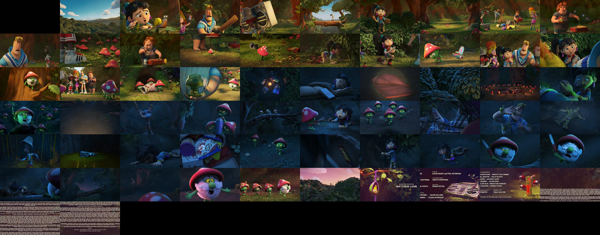

# Video Storybook CLI

Generate storybooks (thumbnail sprites) from videos in the CLI using ffmpeg.

## Requirements

- ffmpeg

## Build

```shell
go build -o generator
```

## Usage

### CLI

```shell
./generator <input> <interval> <maxWidth> <maxHeight> <maxColumns> <output> <metadataOutput>
```

### Docker

```shell
docker run --rm -v <path/to/input>:/sample.mp4 -v <path/to/output/folder>:/output bod8/video-storybook-cli:latest /sample.mp4 <interval> <maxWidth> <maxHeight> <maxColumns> /output/<output> /output/<metadataOutput>
```

### Options

| **Name**            | **Description**                                       |
|---------------------|-------------------------------------------------------|
| _\<input>_          | Path to input video file                              |
| _\<interval>_       | Frame interval in seconds                             |
| _\<maxWidth>_       | Maximum width of a single frame in the output sprite  |
| _\<maxHeight>_      | Maximum height of a single frame in the output sprite |
| _\<maxColumns>_     | Maximum number of columns in output sprite            |
| _\<output>_         | Path to output sprite file                            |
| _\<metadataOutput>_ | Path to output sprite metadata file                   |

# Example

The sprite was generated from [some Blender sample video](https://files.vidstack.io/sprite-fight/720p.mp4).

